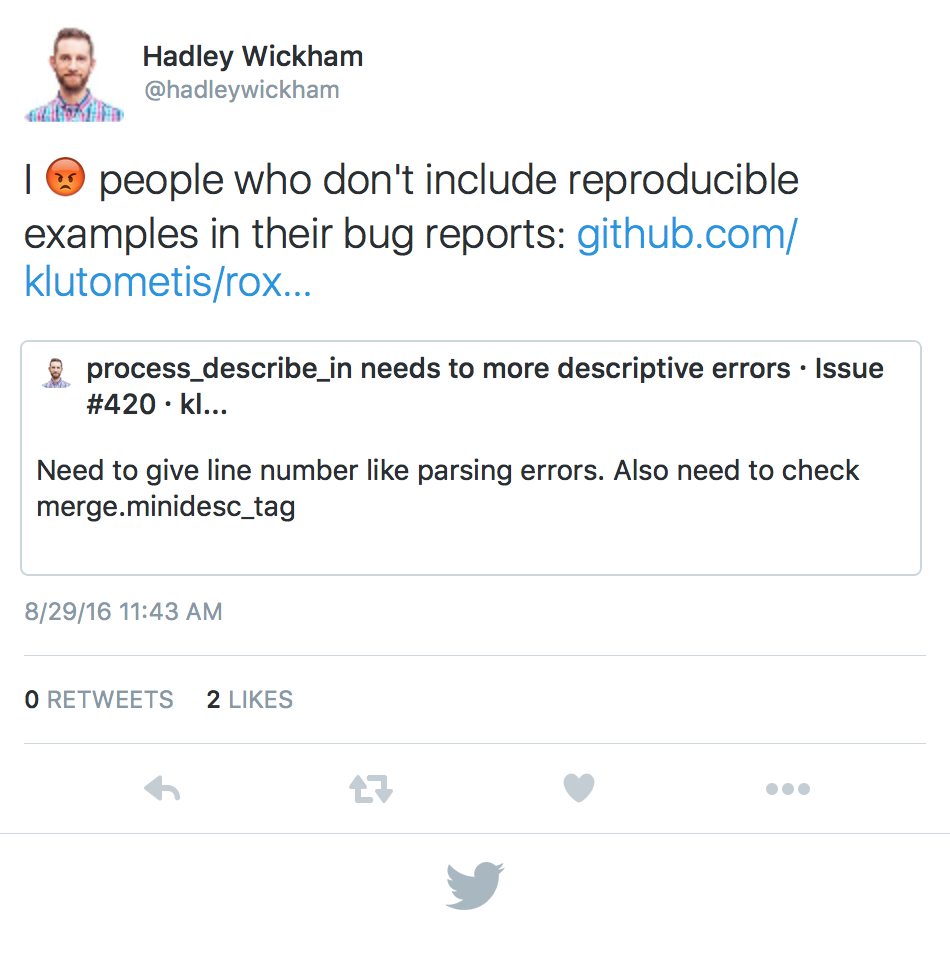

---
title       : Getting to know R
subtitle    : A brief introduction
author      : Christopher Chizinski
job         : Assistant Professor
framework   : io2012        # {io2012, html5slides, shower, dzslides, ...}
highlighter : highlight.js  # {highlight.js, prettify, highlight}
hitheme     : tomorrow      # 
widgets     : [mathjax, quiz, bootstrap, interactive] # {mathjax, quiz, bootstrap}
ext_widgets : {rCharts: [libraries/nvd3, libraries/leaflet, libraries/dygraphs]}
mode        : selfcontained # {standalone, draft}
knit        : slidify::knit2slides
logo        : huntfish.png
biglogo     : R.jpeg
assets      : {assets: ../../assets}
--- .class #id

## Who am I?

> - Assistant professor of Human Dimensions of Wildlife Management in the [School of Natural Resources](http://snr.unl.edu/) at the [University of Nebraska-Lincoln](http://www.unl.edu/)
> - R enthusiast since 2007
> - Contact and info
 - Email: cchizinski2@unl.edu
 - Lab website:  http://chrischizinski.github.io/
 - Github:  https://github.com/chrischizinski

--- .segue bg:lightblue

# About this course ...

--- .class #id

## Purpose 

The purpose of this series is to provide a basic introduction to R, how to import and export data from R, how to wrangle data once you get it ito R, and then how to create presentation and publication quality graphics in R.  The course will pull strongly from the [hadleyverse](http://adolfoalvarez.cl/the-hitchhikers-guide-to-the-hadleyverse/).

--- .class #id

## Repositories

I will provide a copies of all the R code, presentations, and (potentially) the recorded webinars through `github`.  I have set up a repository through [https://github.com/chrischizinski/OFWIM_2016](https://github.com/chrischizinski/OFWIM_2016) as well as a [github-page]( https://chrischizinski.github.io/OFWIM_2016/) for the course.  

Feel free to contact me anytime for questions. 

--- .segue bg:lightblue

# Let's get started ...

--- .class #id

## What is R?
> - R is an open-sourced, [object-oriented](http://adv-r.had.co.nz/OO-essentials.html) computer language 
  - data analysis 
  - programming
  - graphics 
> - Extremly versatile with almost 9000 packages
  - [5th place in IEEE language rankings](http://spectrum.ieee.org/static/interactive-the-top-programming-languages-2016)
  - This document was written with R, Rstudio, and the `slidify` package

--- .class #id

## Why R?

> - R runs on Windows, Mac-OS, and Unix operating systems
> - R provides a vast number of useful statistical tools (and you can write your own)
> - R produces publication-quality graphics in a variety of formats
> - R allows you to generate documents and html 
> - R can be integrated with many other programming languages
> - R scales, making it useful for small and large projects
> - There is a huge user base with lots of blogs and answers for your many, many questions
> - R steers clear of point-and-click analysis

--- .class #id

## Why not R?

> - R can do a lot but it cannot do everything.
> - There is a decent learning curve
> - There have been many improvements over the years but some of the documentation can be opaque.
> - R will make you want to throw your computer through the wall at some point. 
> -  Contributed packages go through a lot of testing but some are better and more reliable than others 
> - R steers clear of point-and-click analysis

--- .class #id

## Where can I get R?
> - Download R from CRAN ([Comprehensive R Archive Network](https://cran.r-project.org/))
> - It can be installed on  Linux, Windows, or Mac operating systems.  
    - Choose the current stable version 
    - If you are downloading for PC, I would also download `RTools`
> - Update FREQUENTLY

--- .class #id

## How do I run R?

### Base R
- Many ways that you can run R (terminal to GUI).  
- Let's open up base R
- Basic
  -  while OK it does not have some of the bells and whistles other GUIs have.  

### RStudio
- [RStudio](https://www.rstudio.com/home/) 
- Let's open up RStudio
  - includes a code editor with syntax highlighting, debugging, and visualization tools
  - [Cheatsheet](https://www.rstudio.com/wp-content/uploads/2016/01/rstudio-IDE-cheatsheet.pdf)

--- .class #id

## Running R

> -  Console
    - Only for "one off" things, installing packages etc. 
> - Script editor
  - keep all of my code in scripts 
    - reuse code and run things again at a later time
  - [Reproducible Research](https://www.crcpress.com/Reproducible-Research-with-R-and-R-Studio-Second-Edition/Gandrud/p/book/9781498715379)
  - Good housekeeping is to label script files
      - `bird_analysis-08-17-16.R` 

--- .class #id

## How do I learn R?

> - R is not easy.  
> - Best strategy is **immersion**, **immersion**, **immersion**!
> - R is no different than other foreign languages
> - Recognize the nuances of the language 
  - use it to its fullest ability (even if this requires hacks and work-arounds)
> - Payoff is HUGE!

--- .class #id

## Hiccups in R

Newbies to R (myself included) tend to get hung up on three primary areas when learning R:

> 1. Getting data into R
> 2. Understanding the structure of your data (e.g., selecting columns and rows)
> 3. Understanding the error messages

--- .class #id

## How do I get help in R?

The beauty of R and its large and diverse user base is that there is a lot of help out there for you.  There are sources that tend to be more prickley (e.g., [R mailing lists](https://www.r-project.org/mail.html)), to moderatly so (e.g., [stackoverflow](http://stackoverflow.com/questions/tagged/r)), and most forgiving (e.g., [google groups](https://groups.google.com/forum/#!forum/unmarked)).

There tend to be three areas that I think students learning R get tripped up on when trying to find help.

--- .class #id
## First:  "How do I do so and so in R?" 

Call up your favorite search engine and do a search for your question (and add "in R").  For example, to search how to do a linear regression in R, I would pull up google and search "linear regression and R."  Generally, your search results will include tutorials, packages, or questions posted on the online help sites.

--- .class #id

## Second:  "How do I use this function in R?" 

Like the first bullet you can always do a search and come up with an answer.  There are several ways to find help within R for a particular function.  `help(function_name)` or `?function_name` will bring up the documentation on the particular function you are interested in.  This is where I almost always start when I am having issues with a particular function because the pages called will have the input parameters and various options.  

--- .class #id

## Third:  "What does this warning or error mean?" 

 Part of this will come as you spend more and more time learning the R language but everyonce in a while you will get an error that you have no clue.  Very often I will copy that error from the console and past it into google.     

--- .class #id

## Finally asking for help

--- .class #id

## Finally asking for help

The key to getting good feedback no matter from what source is to:

1. Google search the issue.  It is more than likely that someone else has already had the issue
2. Do not make it seem like you are asking questions about a homework assignment
3. provide a [reproducible example](http://stackoverflow.com/questions/5963269/how-to-make-a-great-r-reproducible-example).  

I think going through the process of trying to make a reproducible example ends up helping you solve your issue before you even post to one of the help sites. 

--- .segue bg:lightblue

# That is all I had for today ...

--- .class #id

## Next webinar

- Next time getting data into R and basic data structures

--- .segue bg:lightblue

# Questions?

